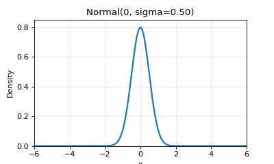
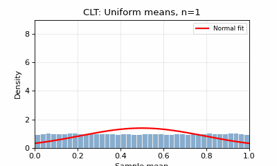
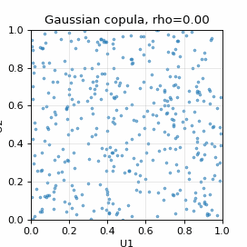
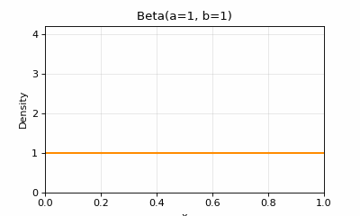
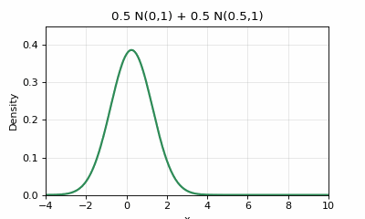

# Examples

Runnable scripts live in `examples/`.Docs snippets below mirror them.

## Gallery







All GIFs are generated reproducibly via `python examples/generate_media.py`.

## Basic usage (`examples/basic_usage.py`)

```bash
python examples/basic_usage.py
```

Covers Normal/Exponential/Binomial PDF+CDF plots plus a Normal comparison chart.

## CLT demonstration

```python
from probviz.distributions import UniformDistribution, NormalDistribution
import numpy as np

uniform = UniformDistribution(a=0, b=1)
means = [np.mean(uniform.rvs(size=n, random_state=i)) for i in range(2000) for n in [30]]
```

(See `README.md` for the full 2×2 subplot version.)

## Binomial vs Poisson approximation

```python
from probviz.distributions import BinomialDistribution, PoissonDistribution
import numpy as np

n, p = 100, 0.03
b = BinomialDistribution(n=n, p=p)
approx = PoissonDistribution(lambda_param=n * p)
x = np.arange(0, 15)
print(b.pdf(x) - approx.pdf(x))  # small residuals validate the approximation
```

## Fitting + Monte Carlo

See [Fitting](fitting.md) and [Monte Carlo](monte-carlo.md) for copy-pasteable
`DistributionFitter` and `MonteCarloSimulator` snippets.
